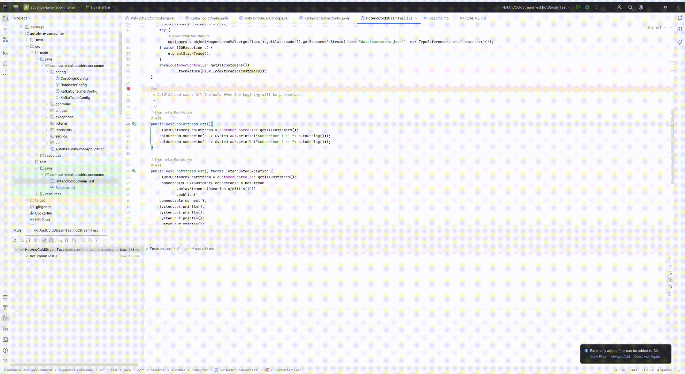
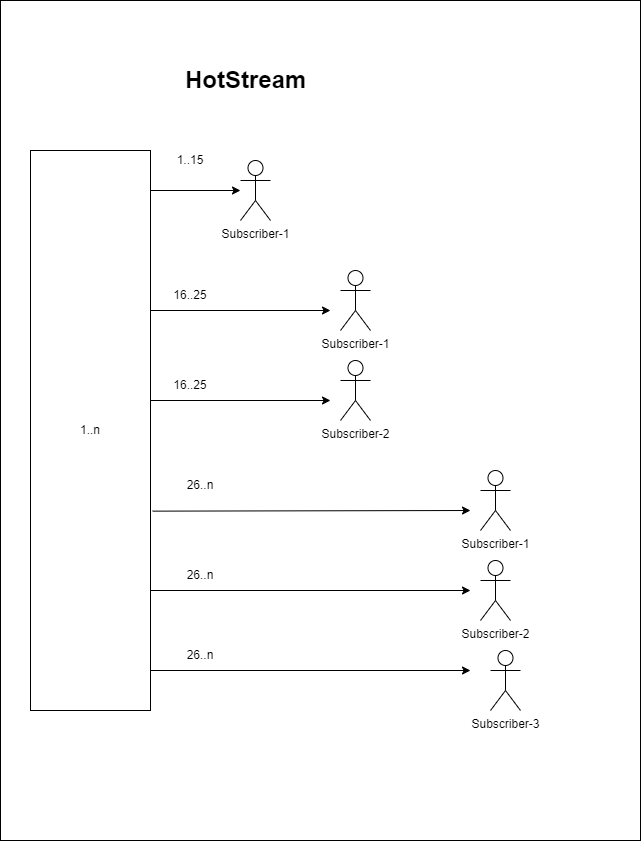
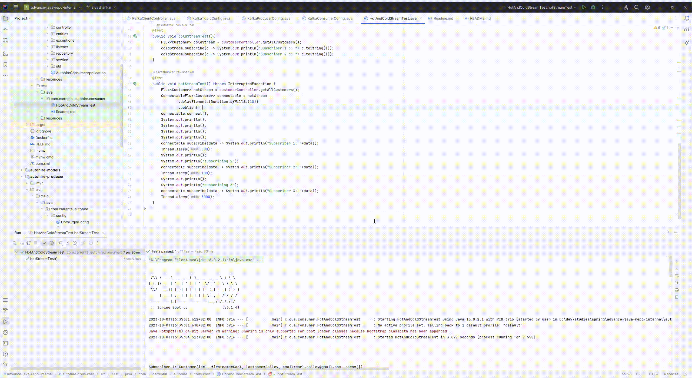
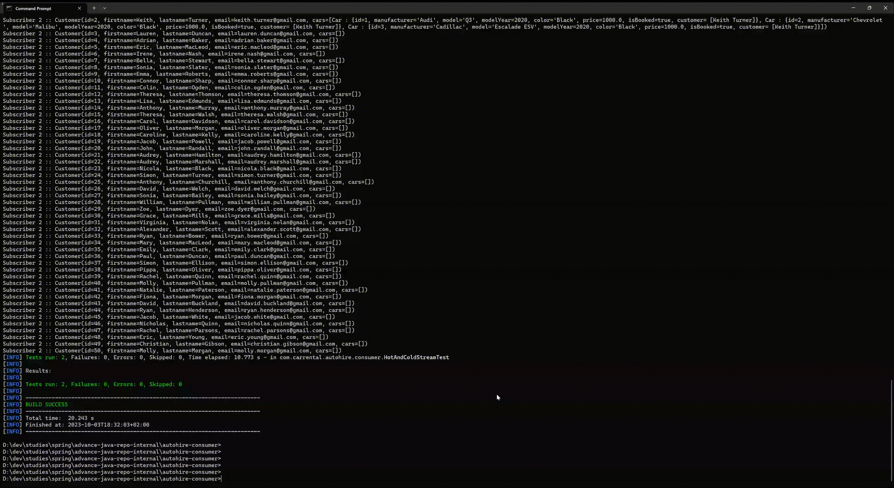

# How to run the HotAndColdStreamTests

## To Run from IDE
1. Import the cloned project into IDE like IntelliJ or Eclipse
2. Cold Stream is like something below. All subscribers will get all data whenever they subscribe to the flux
   
3. Click the Run Button against the ColdStreamTest method
   
4. Hot Stream is like something below. All subscribers will get only data that are emitted when they are subscribed
   
5. Click the run button against the HotStreamTest method
   

6. To Run Hot and cold Stream using mvn test
   
