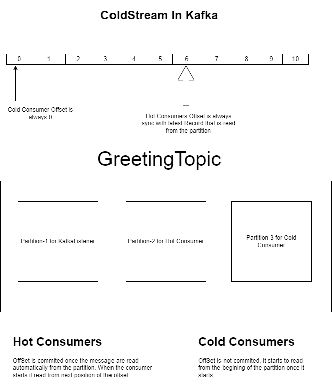

# Hot and Cold Consumers of Kafka
The setup is as given below

1. There is one topic called autohire-greeting.
2. This topic has 3 Partition and one replica for demo purpose.
3. There are 3 Listeners/Consumers with each group id. Please check group.id values.
4. When the consumer starts each group will be assigned to each partition.
5. Hot Listeners/Consumers reads messages from the latest offset. After reading from the partition, the offset will be committed.
6. Cold Listener/Consumer always reads from the initial offset since it is not committed.

## Model to learn

## How to ?
